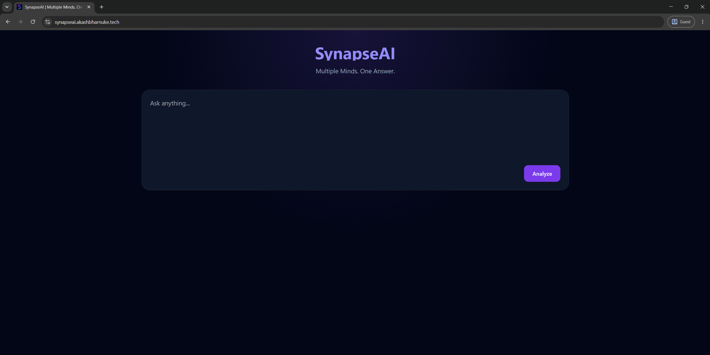

# 🧠 SynapseAI

<div align="center">

### **Multiple Minds. One Answer.**

*A Self-Consistency AI Engine that orchestrates multiple LLMs to generate higher-quality answers through consensus.*


</div>

---


🌐 **Live Demo:** [ https://synapseai.akashbharnuke.tech/ ]

🎥 **Demo Video:** [Watch Demo](docs/demo/demo.mp4)


---

## 📖 Overview

Most AI applications rely on a **single language model** to answer a user's question.

SynapseAI explores a different approach.

It asks multiple independent LLMs the same question, collects their responses, and synthesizes a final answer using a dedicated **Judge Model**.

This follows the **Self-Consistency** reasoning technique, helping improve response quality, reduce hallucinations, and provide greater confidence in the final output.

---

## 📸 Preview



---


## 🌟 Highlights

- 🔄 Parallel Multi-LLM Orchestration
- 🧠 Self-Consistency Reasoning Workflow
- ⚖️ Judge Model for Consensus Generation
- 📡 Real-Time Streaming via Server-Sent Events (SSE)
- 📝 Markdown & Code Syntax Rendering
- 🐳 Dockerized Deployment with Nginx & SSL

---

## ✨ Features

- 🚀 Multi-model orchestration
- ⚡ Parallel execution
- 🧠 Self-Consistency answer synthesis
- 🤖 Dedicated Judge Model
- 📡 Real-time streaming using Server-Sent Events (SSE)
- 📊 Live model status updates
- ⏱️ Latency reporting
- 🎟️ Token usage reporting
- 📝 Markdown rendering
- 💻 Syntax highlighted code blocks
- 📱 Responsive UI

---

## 🏗️ Self-Consistency Workflow

```                    👤 User
                       │
                       ▼
               💻 SynapseAI UI
                       │
                 Server-Sent Events
                       │
                       ▼
                🚀 Express Backend
                       │
                🧠 Orchestrator
        ┌─────────┼──────────┐
        ▼         ▼          ▼
   GPT-4.1    DeepSeek     Phi-4
        │         │          │
        └─────────┼──────────┘
                  ▼
          ⚖️ GPT-4o Judge
                  │
                  ▼
         ✨ Consensus Response
                  │
                  ▼
             Stream to UI
```

## 🧩 Tech Stack

| Layer | Technology |
|--------|------------|
| Frontend | Vanilla JavaScript |
| Styling | Tailwind CSS |
| Backend | Express.js |
| Runtime | Node.js |
| Streaming | Server-Sent Events (SSE) |
| Markdown | Marked.js |
| Syntax Highlighting | Highlight.js |

---

## 🤖 AI Models

| Purpose | Provider | Model |
|----------|----------|-------|
| Primary | OpenAI | GPT-4.1 Mini |
| Primary | OpenRouter | DeepSeek-R1 |
| Primary | GitHub Models | Phi-4 Mini |
| Judge | OpenAI | GPT-4o |

---

## ⚙️ How It Works

1. User submits a prompt.
2. SynapseAI sends the prompt to multiple LLMs in parallel.
3. Each provider independently generates a response.
4. Responses are streamed to the frontend in real time.
5. The Judge Model analyzes all responses.
6. A synthesized consensus is generated and displayed.

---

## 📂 Project Structure

```text
.
├── public/
│   ├── js/
│   ├── css/
│   └── assets/
│
├── src/
│   ├── config/
│   ├── controllers/
│   ├── middleware/
│   ├── prompts/
│   ├── providers/
│   ├── routes/
│   ├── services/
│   └── utils/
│
├── docs/
├── Dockerfile
├── docker-compose.yml
└── README.md
```

---

## 🌐 Deployment

SynapseAI is deployed using:

- Docker
- Docker Compose
- Nginx Reverse Proxy
- Let's Encrypt SSL

---

## 🚀 Getting Started

### Clone the repository

```bash
git clone https://github.com/yourusername/synapse-ai.git

cd synapse-ai
```

### Install dependencies

```bash
npm install
```

### Configure Environment Variables

```env
OPENAI_API_KEY=
GITHUB_TOKEN=
OPENROUTER_API_KEY=
```

### Start the application

```bash
npm start
```

The application will be available at:

```
http://localhost:3000
```

---

## 🐳 Deployment

SynapseAI is designed to be deployed using:

- Docker
- Docker Compose
- Nginx Reverse Proxy
- SSL via Certbot

Detailed deployment instructions are available in the `/docs` directory.

---

## 🛣️ Roadmap

### v1.2

- Conversation history
- Prompt templates
- Copy responses
- Better loading animations

### v1.3

- Langfuse integration
- Prompt versioning
- Cost tracking
- Analytics dashboard

### v1.4

- Claude
- Gemini
- Grok
- Ollama
- Pluggable provider architecture

---

## 📸 Screenshots

> *(Add screenshots or a demo GIF here after deployment.)*

---

## 📝 Technical Documentation

A detailed technical reference covering the architecture, orchestration flow, and implementation decisions is available in:

```text
docs/
└── SynapseAI-v1.1-Technical-Reference.md
```

---

## 💡 Why SynapseAI?

SynapseAI is an exploration of **AI orchestration** rather than simple AI integration.

Instead of trusting a single model, it demonstrates how multiple specialized LLMs can collaborate to produce stronger, more reliable answers through consensus.

The project also serves as a foundation for future experimentation with evaluation pipelines, observability, provider benchmarking, and advanced orchestration strategies.

---

<div align="center">

**Built with ❤️ using Node.js, Express, and Multiple LLMs**

*"Multiple Minds. One Answer."*

</div>